# Assignment 0: A First Look at Java

## Submission date: September 18th 2023

In this first assignment, we have our first contact with the development environment that we will use to carry out all the assignments of the *Programming Technology I* course. It takes the form of a step-by-step guide. Most of the steps described will also be needed in the following assignments since they show how to organise the different files, that is, the folder structure to be used, how to create Eclipse projects and how to submit the assignments.

Throughout the course, we will use [*Java17*](https://www.oracle.com/java/technologies/downloads/#java17) and [*Eclipse 23.03*](https://www.eclipse.org/downloads/packages/release/2023-03/) since these are the versions of these software tools that are installed in the FDI labs.

In fact, Eclipse 2023-03 comes with an integrated JRE 17. Another installation is not required.

<!-- but, at least to carry out the present assignment, you will also need to install Java 17 separately. -->

With a little care, you can use later versions if you wish but, for the lab correction and for the exam, **you must make sure that your code also compiles and executes correctly using official versions**.

## Folder structure

We start by briefly describing the structure of the folders to be used in all the assignments. The use of a clear folder structure is
important for a project that contains files of various different types. During the development of each assignment, we will use the following 
folders:

- `src`: This folder contains the source code of the solution to the assignment (comprising files with the extension `.java`). It should be the only folder containing files created by the student; the other folders will either contain files generated automatically by Eclipse or provided by the lecturer.

- `bin`: This folder contains the files which result from compiling the source code. They are created automatically by the IDE (in this case, Eclipse). When submitting your solution to an assignment, you should **not** submit the files contained in this folder.

Subsequent assignments may use additional folders. If an assignment uses external libraries provided by the lecturer, there may be another folder at the same level as `src` and `bin` containing these libraries.

## Part I: "Hello World" on the console

The first part of the assignment consists of creating a simple Java program to write the message `Hello World!` on the console.

### Step 1:

Open a terminal `cmd.exe` (Windows > Ejecutar > `cmd.exe`)[^1] and execute the following command in this terminal: `cd c:\hlocal`
in order to set the current folder to `hlocal`. Now open a text file called "HelloWorld.java" in this folder using notepad,
notepad++, VS Code or any other text editor. The following figure shows how to invoke notepad from the Windows command line.


Alternatively, open the text editor using the appropriate icon, create a new file called "HelloWorld.java" and save it to the
`hlocal` folder.

### Step 2:

Now define a class called "HelloWorld" by copying the code given below to the text file created in the previous step. Note that
the name of the class must be the same as the name of the file (including the case of the letters). Note also that, by convention,
class names always begin with an upper case letter.

```Java
public class HelloWorld {
    public static void main(String[] args){
        System.out.println("Hello World!");
    }
}
```


### Step 3:

We can compile the `HelloWorld.java` source-code file from the Windows command line via the following command:

```
javac HelloWorld.java
```

If there are no compilation errors, a file called `HelloWorld.class` containing the corresponding bytecode will be created

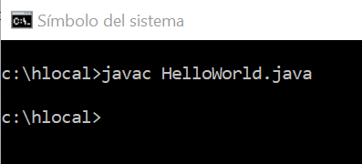

However, if the path to the compiler executable (`javac.exe`) is not one of the paths contained in the `PATH` environment variable, the system will not find this executable and, consequently, will not be able to execute the `javac` command. To this end, we add the address of the `bin` folder of the JDK, which contains the executable file for this command and others, to the list of paths contained in the `PATH` variable. In the labs the required path is `C:\JDK\jdk17-x86_64\bin` which we can add to the `PATH` variable from the Windows command line as follows:

```
set PATH=C:\JDK\jdk17-x86_64\bin;.;%PATH%
```

We can now check that we are using the correct version of the JDK by executing the following command:

```
java -version
```

as shown in the following figure:


### Step 4:

Executing our application involves executing the Java virtual machine (JVM) and telling it to use the `main` method of the bytecode contained in the file `HelloWorld.class` as the entry point to the application. We do so by executing the command `java HelloWorld`[^2]. As was the case for the command to compile the java source code, the JVM executable, `java.exe`, must be in one of the folders of the `PATH` environment variable or the OS will not be able to find it and execute it. In the labs this executable can be found in the same folder as the compiler executable (the `bin` folder of the JDK), which we have already added to the `PATH` variable.


## Part II: "Hello World" in Eclipse

Before using the Eclipse IDE (Integrated Development Environment), we need to learn the meaning of *workspace*.

1.  A *workspace* is the name of the folder in which the Java projects created in Eclipse will be stored.
2.  An executing instance of Eclipse must have a workspace.
3.  Changing the workspace requires restarting Eclipse.

In the following, we will assume that the workspace is located in the folder `c:\hlocal\TP`[^3]. A *project* is a new folder that is created in the workspace. You should create a new project for each assignment (in spite of the fact that the assignments are cumulative). In each project, we will create the following folders:

- `src`: The folder containing the source code, i.e. files with the extension `.java`. **This is the folder that must be saved (on your Z drive, on GDrive, on OneDrive, etc.) at the end of each lab session since the contents of the `hlocal` folder are deleted when the user logs out of a session**.

- `bin`: The folder containing the *bytecode* resulting from the compilation of the source code and interpretable by the JVM, i.e. files with the extension `.class`. **It is not necessary to save the contents of this folder between lab sessions since they can be generated from the source code**. By default, this folder is hidden in Eclipse but you can check its content via the file manager of your system.

We now translate the previous example to the Eclipse platform.

### Step 1:

Execute `Eclipse.exe`.

### Step 2:

Create a new workspace. If Eclipse is already open, change the desired workspace via *File* -> *Switch Workspace*.

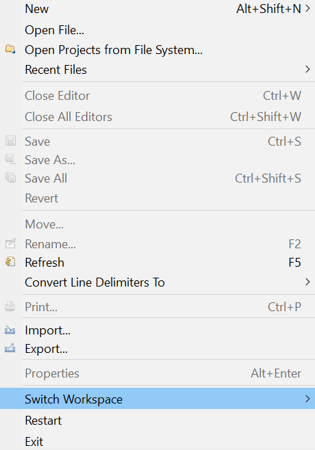
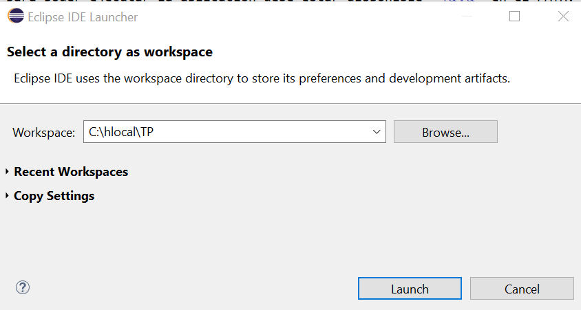

### Step 3:

Create a project: *File* -> *New* -> *Java Project*. Recall that you should create a new project for each assignment. Note that in the last section of the *New Java Project* window called *Module* **deselect the *Create module-info.java file*** if it is selected.


### Step 4:

On creating a project you must indicate the location of the folders where you wish to store the source code and the compiled code. You can simply accept the default values proposed by Eclipse (i.e. two top-level folders: `src` and `bin`).

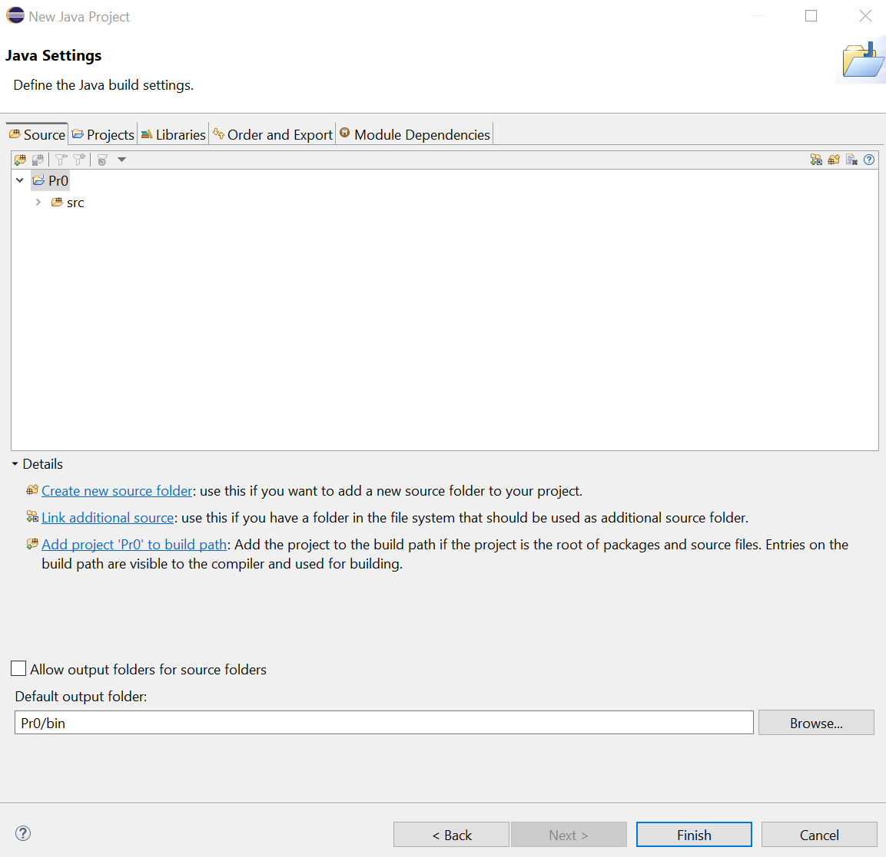

### Step 5:

Strictly speaking, this step is not required when working in English since, in that case, there is no need to use any non-ASCII characters (note that the comments in your code should also be in English). However, since it is information of interest for using Eclipse in a non-English speaking country, if you want to use non-ASCII characters in your comments, it is advisable to configure the project to use the *UTF-8* character encoding. To do so, select the project, click on it with the right mouse button and select the *Properties* option. Then choose the *Resource* menu and modify *Text File Encoding*, selecting *Other* and indicating *UTF-8*.


Instead of setting the character encoding for each project, you can also set it for all the projects in a workspace. To do so, select *Window* -> *Preferences* and choose the *General* -> *Workspace* menu. Then modify the *Text File Encoding*, selecting *Other* and indicating *UTF-8*.


### Step 6:

Having configured Eclipse and created a new Java project, we now write our first program, creating a class called `HelloWorld.java` by selecting 
*new Class* in the *File* menu. As well as providing the class name, you can also ask Eclipse to create the stub of the `main` method.

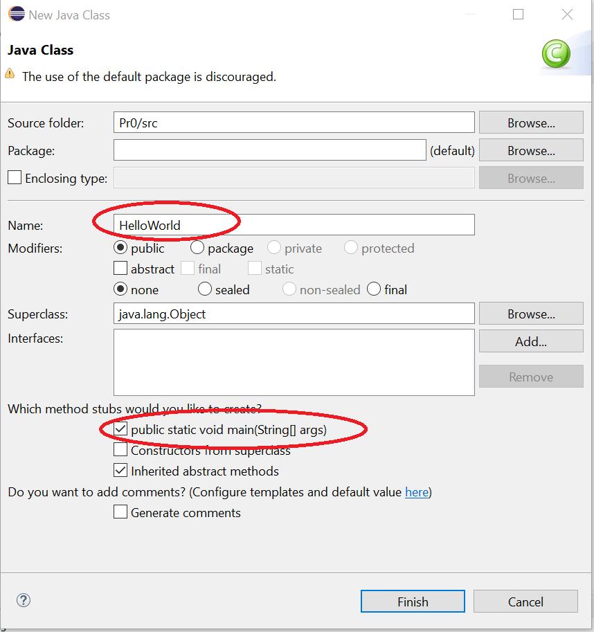

### Step 7:

We see that Eclipse has created the file `HelloWorld.java` in the appropriate folder `C:\hlocal\TP\Pr0\src\HelloWorld.java`.

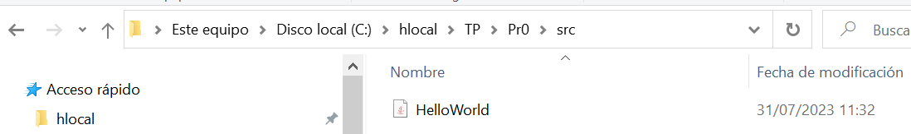

### Step 8:

Write the code of the "HelloWorld" class.

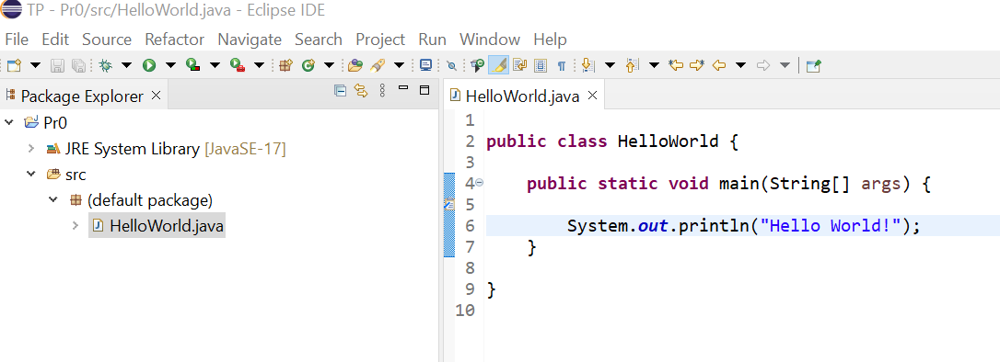

### Step 9:

Eclipse offers different ways to execute the application, one of them being:

-   Select the `HelloWorld.java` file in the *Package Explorer* tab (situated on the left).
-   Click on the right button.
-   Select *Run As* -> *Java Application*.


Another alternative is to click on the green "Run" icon after selecting the `HelloWorld.java` class in the *Package Explorer* tab.


### Step 10:

Eclipse has now compiled our source code file and the result of this compilation is a file called `HelloWorld.class` in the `C:\hlocal\TP\Pr0\bin\` folder.


## Part III: using packages

In Eclipse, classes are organised in *packages*. To create a package, select the *src* folder using Right-Click in the *Package Explorer* tab and then select *File* -> *New* -> *package*.

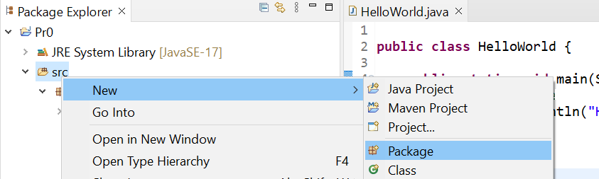

Create the package `tp.pr0`.


Create the class `Pr0Main` in the package `tp.pr0`.

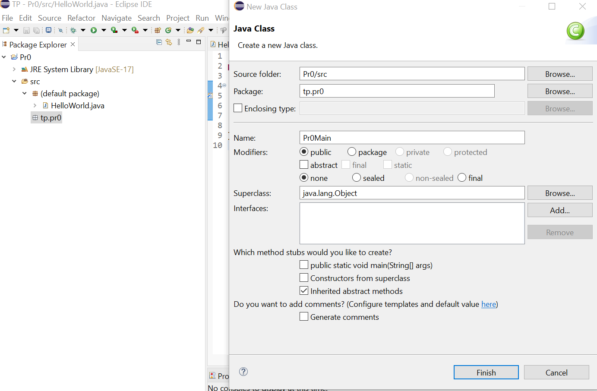

In this class, as well as having a `main` method, in order to be executable, we are going to add another static method that will be called from the `main`. Being a static method, it is not necessary to instantiate an object in order to invoke it on that object; instead, it is invoked using the name of the class.

``` Java
package tp.pr0;

public class Pr0Main {

   public static void writeGreeting(String name) {
      System.out.println("Hello, " + name);
   }

   public static void main(String args[]) {
      Pr0Main.writeGreeting("Bender Bending Rodríguez");
   }
}
```

**Observations:**
-   By convention, the names of the data elements and methods in a class are written in lower case (except if built from several words, e.g. writeGreeting, in which case an upper-case letter is used for the first letter of each word except the first), whereas the names of classes (and interfaces) begin with an upper case letter.
-   All instructions end in \";\".
-   Note the folders that Eclipse creates in the `src` folder to store the source code of the classes belonging to the new package and the location of the files `Pr0Main.java` and `Pr0Main.class`.


## Part IV: mathematics class

In this part, we create a new class containing some simple maths functions which we will call from the `main` method to write a list of combinatorial numbers.

We create the class `MathsFunctions` in the `tp.pr0` package, which contains a main and two static methods:

- `public static int factorial (int n)`

- `public static int combinatorial (int n, int k)`

Both methods are described in the following document generated by the command `javadoc`:


Take into account that, as indicated in the documentation of the class:

*   ${n \choose k} = \frac{n!}{k!(n-k)!}$
*   Factorial of 0 and 1 is 1; if factorial of a negative number is requested, return 0.
*   In the case of the combinatorial numbers, the calculation only makes sense if 0 <= k <= n, that is:
    * If k < 0 or n < 0: return -1,
    * If k > n: return 0,
    * If 0 <= k <= n, apply the formula.

**Observations**:
It is better to save results of the factorial function as a type `long`. <!-- It is better that the local variables used to save results of the factorial function be of type `long`.-->

Once these methods are implemented, we can test them with the following code in the `main` method (commenting o removing the last line):

``` Java
for (int i = 0; i < 6; ++i) {
  //Pr0Main.writeGreeting("Bender Bending Rodríguez");
  for (int j = 0; j <= i; ++j) {
    System.out.print(MathsFunctions.combinatorio(i,j) + " ");
  }
  System.out.println();
}
```

the output of which should be as follows:

``` Java
1
1 1
1 2 1
1 3 3 1
1 4 6 4 1
1 5 10 10 5 1

```


## Part V: simple test with program tracing

Next, we perform a simple test of the previous program. Although, given the simplicity of this assignment, in this case it is obvious whether the output is correct or not, learning this process will be useful to work with the tests of future assignments.

To carry out this test we are going to configure Eclipse to write the output to a file, instead of displaying it by console.

Firstly we will do is create a file[^4] called 'combinatorial_expected_output.txt' by right-clicking on the package 'tp.pr0' *New* -> *File*. In this file, we will add the expected output:

``` Java
1 
1 1 
1 2 1 
1 3 3 1 
1 4 6 4 1 
1 5 10 10 5 1
 
```

Once the file with the expected output is created, we will write our program output into a file. To do this, you must change some parameters of the execution management: Right Click on 'Pr0Main.java' *Run as* -> *Run Configurations...*. Here you will find a tab called 'Commons' that you will have to configure as shown in the following figure:

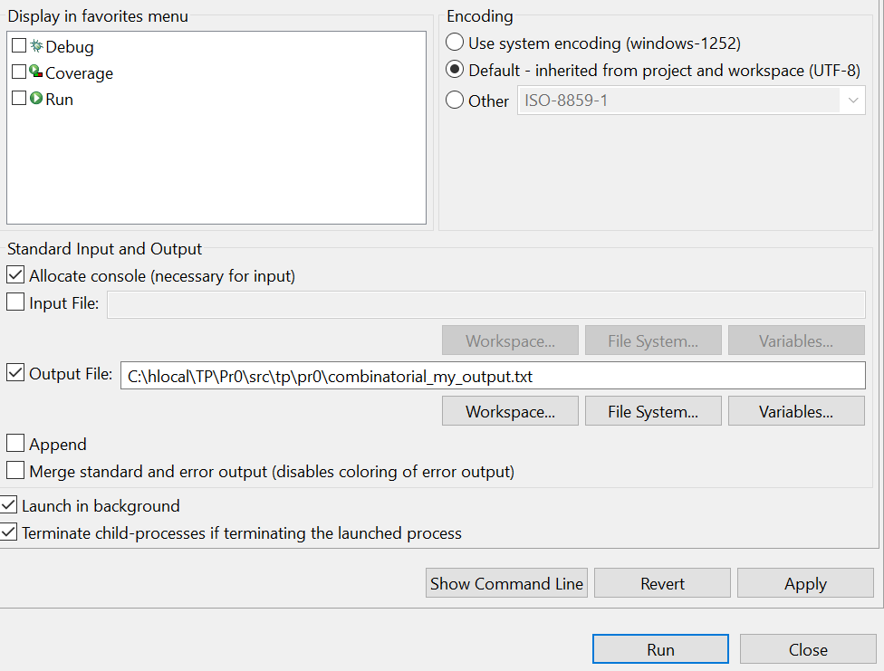


There are many free programs to visually compare files, for example Eclipse already has integrated a tool to compare files that you can launch by selecting two files, right-clicking and in the pop-up menu select 'Compare With > Each other'.


A new window will display where the differences between the files are marked. If the output is as expected, the result will be the following:

![Output Successful in Eclipse File Comparison Tool] (../img/23_24_testing03.png)

If the output does not match, Eclipse will highlight it as follows (in this example the line of the method developed in the previous section was deliberately uncommented):

![Incorrect Output in Eclipse File Comparison Tool] (../img/23_24_testing04.png)


## Part VI: submission of the assignment

To submit the finished assignment, we use the Campus Virtual submission mechanism. The submission deadline for the assignment appears in the problem statement. Before submitting, the solution to the assignment should be compressed in a `.zip` archive called `assignment0.zip`. The contents of the zip archive should be as follows:

- A text file `students.txt` containing the name of each of the members of the lab group.

- The folder `src` containing the source code of the solution.

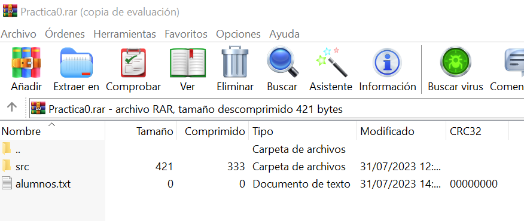

- Optionally, the project files / folders generated by Eclipse, namely the files `.classpath` and `.project` and the folder `.settings` (by default, `.settings` and `.project` are not visible in Eclipse).

You can use the option *File* -> *Export* -> *Archive File* to generate a *zip* archive from scratch and to choose the folders and files that you wish
to include in it.


[^1]: All the assignments of the course can be executed on any platform on which Eclipse can run; in this description, we assume that Windows is being used.

[^2]: Observe that we do not include the extension `.class`.

[^3]: It is inadvisable to use a USB memory stick as a workspace since the lifetime of such memory can be drastically reduced by the large quantity of operations which will be performed on it. <!-- It is also inadvisable to use a mounted remote filesystem as a workspace due to the slower speed and to the large quantity of intermediate files that can be generated. However, between lab sessions, you may wish to store source code files on the 100MB of remote filesystem space available to each student (which is visible from any lab computer both in Windows and in Linux: just click on the icon labelled "MontarZ" to use it).-->

[^4]: In further assigments, wou will be provided with test files both the expected input and output.


## Appendix 1: Markdown display tool

To finish configuring Eclipse, we are going to install (or check that it is already installed) a Markdown-display tool that will be useful later on. Markdown is a simple, lightweight, markup language for creating formatted text whose source code is comfortably human-readable. To install the display tool in Eclipse:

- Select *Eclipse Marketplace* in the *Help* menu.


In the search textbox write "*wikitext*":


Check that you have the "*Mylyn WikiText 3.0*" plugin installed. Both in FDI labs and on your own computer installation, it will appear by default as long as you are using the recommended version of Eclipse.


## Appendix 2: Configuring Eclipse to use a different JRE

As stated at the beginning of these instructions, the version of Eclipse that we are using comes with a Java 17 installation. If you prefer, you can use a different version of Java (for instance, in your laptop) by modifying your *workspace* preferences as follows:

Select *Window* -> *Preferences*, type "JRE" in the search textbox, navigate to the option *Java* -> *Installed JREs* and click on the *Add...* button.


In the next window, check that the option "Standard VM" is selected and the click on the *Next...* button.


In the next window, click on the *Directory...* button and select the folder where you have installed the Java installation that you wish to use.

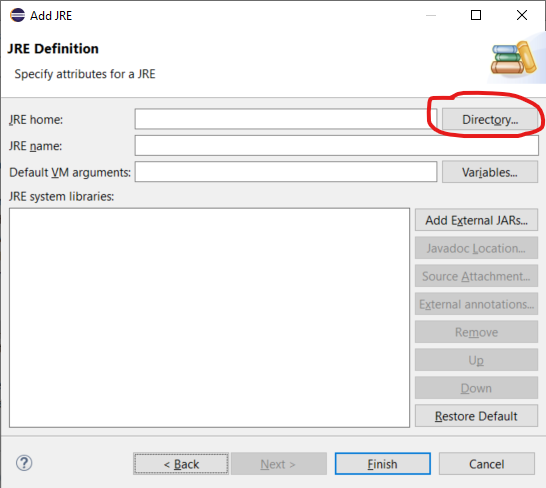

If the folder contains a Java installation, Eclipse will automatically fill in some of the sections of this window. If this is the case, simply click on the *Finish* button.

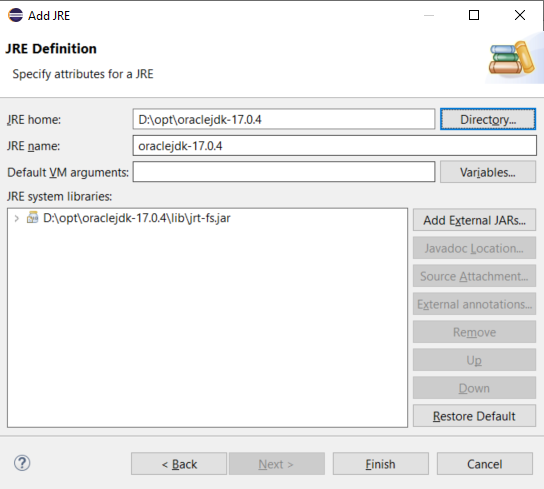

To avoid having to configure each new project to use this Java installation, you can also configure Eclipse to use this installation for all the projects of a workspace.


